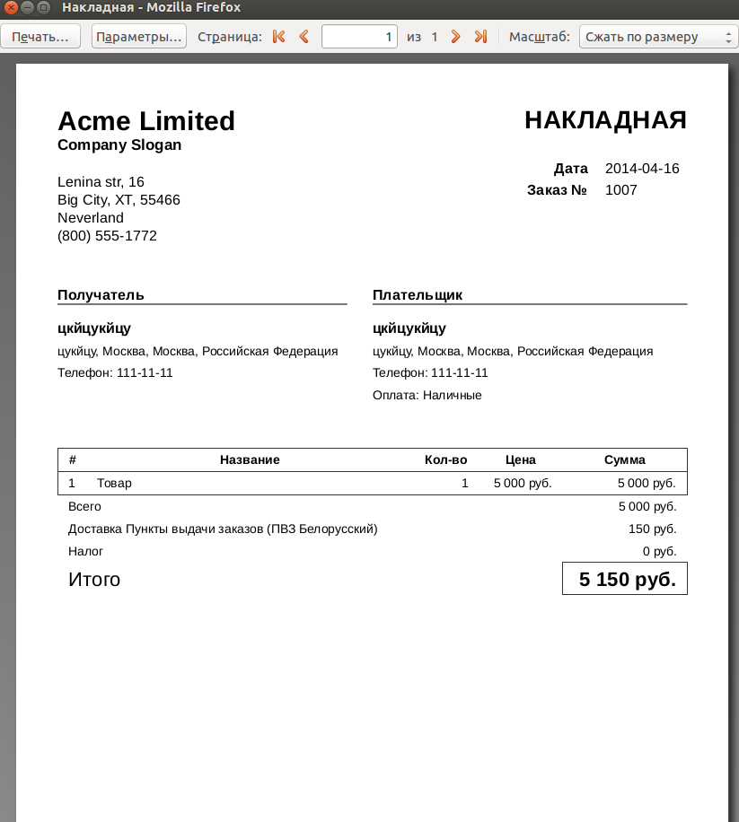

# Простая накладная — плагин для Shop-Script

[English](README.en.md) | **Русский**

Форма печати для заказов Shop-Script. Выводит содержимое заказа в виде накладной — удобно при сборке, доставке и приёмке товара покупателем.

## Возможности

- Отображает состав заказа, адрес и комментарий покупателя
- Поля реквизитов компании (можно оставить пустыми, если не нужны)
- Подсчёт общего количества единиц товара (услуги не учитываются)
- Выделение позиций, количество которых превышает заданный порог
- Редактируемый шаблон — легко адаптировать под свои нужды

## Требования

- Webasyst Framework 2.0+
- Shop-Script 7.1+
- PHP 7.2+

## Установка

Установите плагин через [магазин Webasyst](https://www.webasyst.ru/store/plugin/shop/syrinvoice/).

## Поддержка

[www.syrnik.com/support/](https://www.syrnik.com/support/)

## Changelog

[CHANGELOG.md](CHANGELOG.md)
